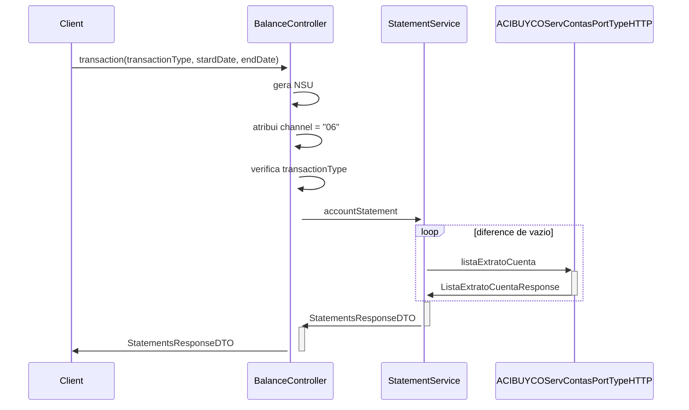

# java-redis
Para visualizar o diagrama de sequência abaixo, instale a extensão [mermaid-diagrams](https://github.com/Redisrupt/mermaid-diagrams)

```mermaid
%% Example of sequence diagram
  sequenceDiagram
    participant Client
    participant BalanceController
    participant StatementService
    Client->>+BalanceController: transaction(transactionType, stardDate, endDate)
    BalanceController->>+BalanceController: gera NSU
    BalanceController->>+BalanceController: atribui channel = "06"
    BalanceController->>+BalanceController: verifica transactionType
    BalanceController->>+StatementService: accountStatement
    loop diference de vazio
      StatementService->>+ACIBUYCOServContasPortTypeHTTP: listaExtratoCuenta
      ACIBUYCOServContasPortTypeHTTP->>-StatementService: ListaExtratoCuentaResponse
    end
    activate StatementService
	StatementService->>-BalanceController: StatementsResponseDTO
	activate BalanceController
	BalanceController->>-Client: StatementsResponseDTO
```
